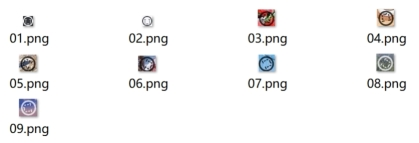
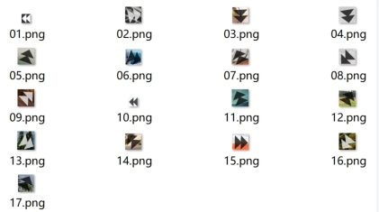

# 点选验证码数据集

### 包含两个数据集：

### 1.点选验证码目标检测数据集：含4300张汉字点选验证码和2000张图标点选验证码，VOC和YOLO格式都有，含数据集划分和格式转换代码。


### 2.图标相似度数据集：含3000张图标点选验证码图片和由其提取的812类图标，每类图标一个文件夹。



数据集文件结构如下：

```xml

datasets

--点选验证码目标检测数据集

    --Annotations

    --JPEGImages

    --ImageSets

    --images

    --labels

    --split.py

    --voc2yolo.py

--图标相似度数据集

    --icons

    --icons_source

```

其中：

VOC格式数据集需要的文件夹：Annotations，JPEGImages，ImageSets

YOLO格式数据集所需文件夹：images和labels

split.py是划分数据集的代码

voc2yolo.py是VOC转YOLO格式的代码

icons是分类好的的图标数据集

icons_source是图标验证码源图片
